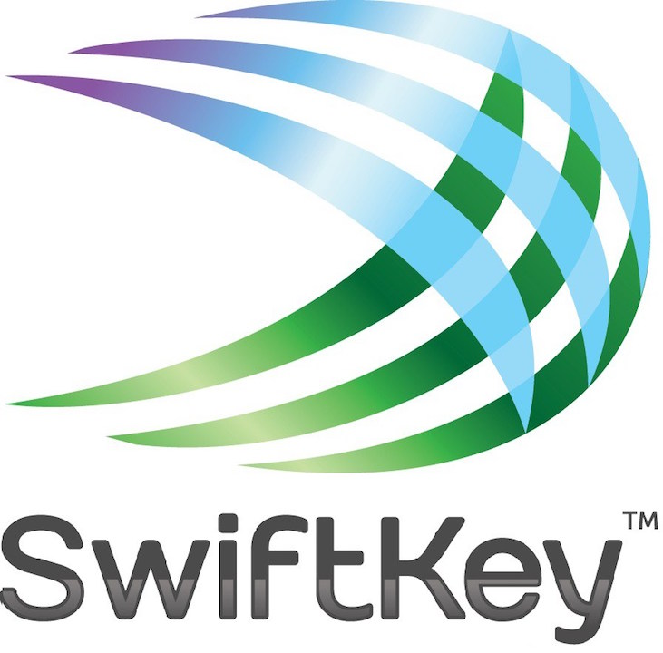
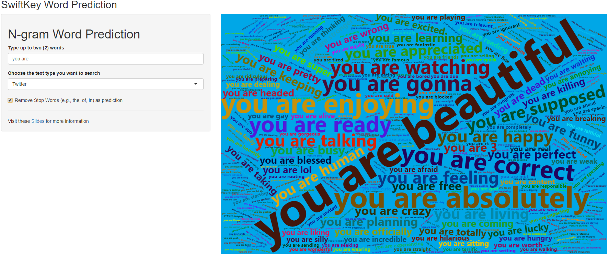

```{r setup, include=FALSE}
knitr::opts_chunk$set(echo = FALSE)
```
# App Overview

* This capstone project is focused on word prediction of text datasets from the SwiftKey Company.
* This app is developed with n-gram algorithm and deployed via R Shiny.
* Instead of only showing the most probable next word, this app creates a word cloud that displays the words with size as and indicator of probability of occurrence.
* See the app [here](https://ancazugo.shinyapps.io/SwiftkeyShinyApp/).



# Approach Explanation

* The data comes from three different sources: Blogs, News and Twitter in English.
* An exploratory data analysis was developed for the whole files and can be seen [here](https://rpubs.com/ancazugo/EDAswiftkey).
* For simplicity of the app, only 10% of each file was used in the development.
* In the development of the Shiny App the packages used were `dplyr`, `tidyr`, `wordcloud2`, `tidytext`.
* Results can be filtered if the user wants to avoid **stop words**, which are words like: *of*, *in*, *the*, among others that in some cases do not provide meaningful information.
* Only 2-gram and 3-gram are used in the development of the app.


# Usage

* Type up to two (2) words in the text box
* Select a type of file you would like to search the word you typed.
* Check the box if you want to exclude stop words in the predicted words.
* Hover over the words in the wordcloud plot to see how many times they appear in the datasets.
* **IMPORTANT NOTE:** The app updates itself and might take up to 10 seconds to plot the wordcloud.

# Usage (Fun Stuff)

* If no word is typed, the app will display the message **TYPE SOME WORDS**.
* If the words could not be found, the app will display the message **WORDS NOT FOUND**.
* If the user types more than two words, the app will display these in the wordcloud.
* The shape of the wordcloud changes randomly.
* The background color changes according to the type of text the user wants to look up into (i.e., twitter blue when twitter is selected).

# App Demo



See the app [here](https://ancazugo.shinyapps.io/SwiftkeyShinyApp/).
