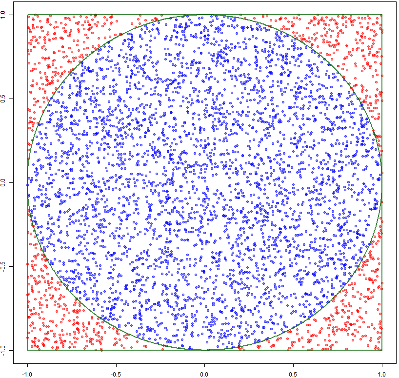
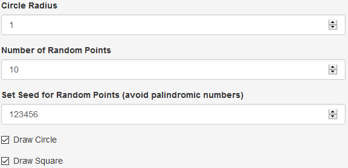

```{r setup, include=FALSE}
knitr::opts_chunk$set(echo = FALSE)
library(ggplot2)
```
# π: The Fundamental Constant
<style type="text/css">
  .reveal p {
    text-align: left;
  }
  .reveal ul {
    display: block;
  }
  .reveal ol {
    display: block;
  }
  img {
    display: block !important;
    margin-left: auto !important;
    margin-right: auto !important;
    height: 350px;
  }
</style>
Pi is an infinite constant that appears in many definitions across physics and mathematics. Among its several definitions, it is the ratio of the circumference and diameter of any circle. Here is a short preview of $\pi$:

```{r comment=''}
print(pi, digits=17)
```

See the app [here](https://ancazugo.shinyapps.io/montecarlo_pi/).

# Circle and Square Areas

Given a circle with radius $r$ inside a square like the one below generated with `r`:
<br />
```{r circle, fig.align='center', fig.width=4, fig.height=4, echo=FALSE}
drawCircle <- function(origin = c(0, 0), radius = 1, npoints = 1000) {
            angles <- seq(0, 2 * pi, length.out = npoints)
            xvalues <- origin[1] + radius * cos(angles)
            yvalues <- origin[2] + radius * sin(angles)
            return(data.frame(xvalues, yvalues))
}
circle <- drawCircle()
ggplot(circle, aes(x = xvalues, y = yvalues)) + geom_path() + geom_vline(xintercept = c(-1, 1)) + geom_hline(yintercept = c(-1, 1)) + theme_void()
```
<br />
The areas of the circle and the square are:
<br />
$$Area_{circle} = \pi * r ^{2}$$
$$Area_{square} = 4 * r ^{2}$$

# Montecarlo estimation of π
The probability of a random point falling in the circle is:
<br />
$$P(Point \ in \ Circle) = \frac {Area_{circle}}{Area_{square}} = \frac {\pi * r ^{2}} {4 * r ^{2}} = \frac {\pi} {4}$$
<br />
Therefore, 
<br />
$$\pi = 4 * P(Point \ in \ Circle) = 4 * \frac {Area_{circle}}{Area_{square}}$$
$$\pi = 4 *\frac {points \ in \ circle}{total \ points}$$

# Random points
Each point is generated using an uniform distribution where:
$$min = -radius$$
$$max = radius$$
<br />
The circle coordinates are defined by:
$$x = h + r * cos(\theta)$$
$$y = k + r * sin(\theta)$$
where, 

* $h$ is the $x$ coordinate of the center of the circle  
* $k$ is the $y$ coordinate of the center of the circle  
* $r$ is the radius
* $\theta$ is any angle in $[0,2\pi]$

# App Parameters
The user is able to define five (5) parameters:

* The radius of the circle
* The number of random points to draw
* The seed for the random numbers generation process
* To show or not a circle as boundary
* To show or not a square as boundary



See the app [here](https://ancazugo.shinyapps.io/montecarlo_pi/).
