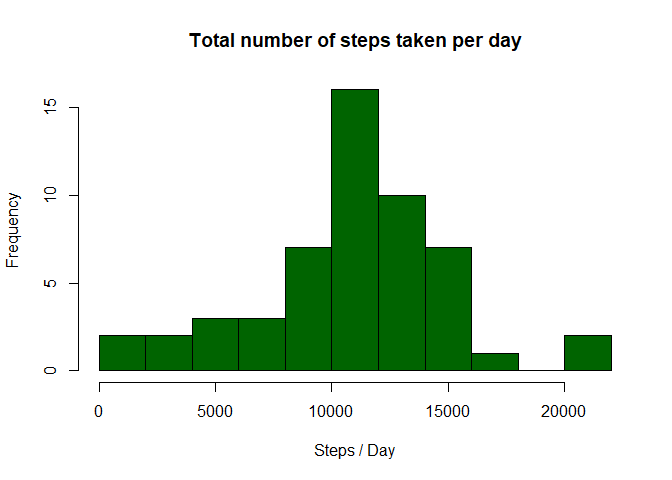
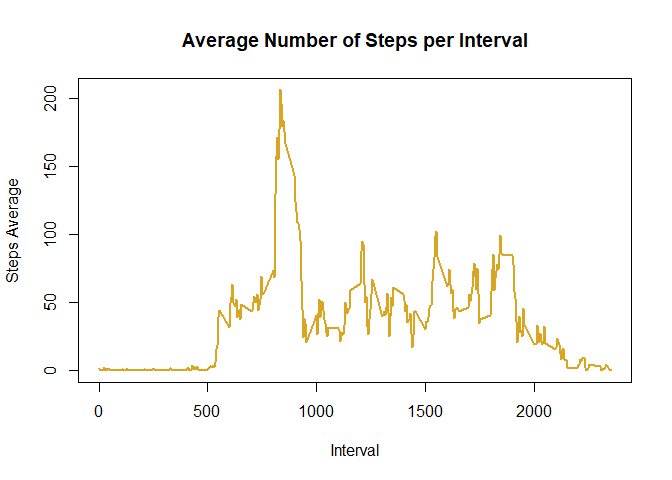
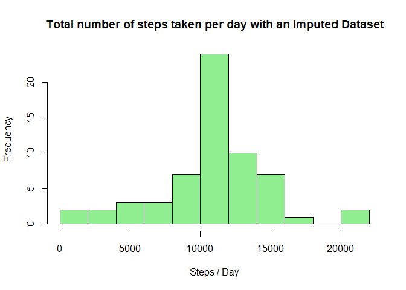
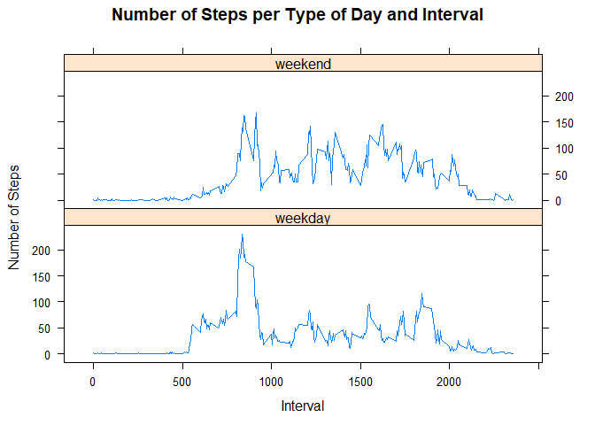

## Loading necessary packages

```r
knitr::opts_chunk$set(options(scipen=999))
library(dplyr)
library(lattice)
```


## Loading and preprocessing the data

The dataset is loaded using `read.csv()` and the date column is formatted as a date using `as.POSIXct()`.  

```r
activity <- read.csv('activity.csv')
activity$date <- as.POSIXct(activity$date)
```

## What is mean total number of steps taken per day?
First, a summary table must be built joining the counts by day. 

```r
byDay <- activity %>%
    group_by(date) %>%
    summarise(TotalSteps = sum(steps))
head(byDay)
```

```
## # A tibble: 6 x 2
##   date                TotalSteps
##   <dttm>                   <int>
## 1 2012-10-01 00:00:00         NA
## 2 2012-10-02 00:00:00        126
## 3 2012-10-03 00:00:00      11352
## 4 2012-10-04 00:00:00      12116
## 5 2012-10-05 00:00:00      13294
## 6 2012-10-06 00:00:00      15420
```

Then a histogram is drawn using the base plotting system on the TotalSteps column of the summary.  

```r
#png('figures/plot1.png', width = 480, height = 480)
hist(byDay$TotalSteps, breaks = 15, main = 'Total number of steps taken per day', col = 'darkgreen', xlab = 'Steps / Day')
```



The mean number of steps taken per day is **10766.1886792** and the median is **10765**.  

## What is the average daily activity pattern?
First a summary of the original dataset must be built according to the interval, just as the question above.

```r
byInterval <- activity %>%
    group_by(interval) %>%
    summarise(MeanSteps = mean(steps, na.rm = T))
head(byInterval)
```

```
## # A tibble: 6 x 2
##   interval MeanSteps
##      <int>     <dbl>
## 1        0    1.72  
## 2        5    0.340 
## 3       10    0.132 
## 4       15    0.151 
## 5       20    0.0755
## 6       25    2.09
```
Then a series plot is built using this dataFrame.  

```r
#png('figures/plot2.png', width = 480, height = 480)
plot(MeanSteps ~ interval, byInterval, type = 'l', lwd = 2, col = 'goldenrod', main = 'Average Number of Steps per Interval', xlab = 'Interval', ylab = 'Steps Average')
```



The interval with the most steps on average is **835** and has **206.1698113** steps.  

## Imputing missing values
The number of NAs in the steps column is **2304**.  
For imputing NA values, first I created a copy of the original dataset. Then I iterated over the rows to check if the steps was NA and then changed its value to what the mean is for the interval of the same row. In addition, I rounded the value of the mean to 0 decimals. For this task I used the summary data for the mean per interval created above.  

```r
activityImputed <- activity
for(n in 1:nrow(activityImputed)) {
  if(is.na(activityImputed$steps[n])) {
    new_step <- byInterval[byInterval$interval == activityImputed$interval[n],]$MeanSteps
    activityImputed$steps[[n]] <- round(new_step)
  }
}
```

For the new histogram, mean and median values per day, I created a new summary using the new dataset.

```r
byDayImputed <- activityImputed %>%
    group_by(date) %>%
    summarise(TotalSteps = sum(steps))
head(byDay)
```

```
## # A tibble: 6 x 2
##   date                TotalSteps
##   <dttm>                   <int>
## 1 2012-10-01 00:00:00         NA
## 2 2012-10-02 00:00:00        126
## 3 2012-10-03 00:00:00      11352
## 4 2012-10-04 00:00:00      12116
## 5 2012-10-05 00:00:00      13294
## 6 2012-10-06 00:00:00      15420
```

```r
#png('figures/plot3.png', width = 480, height = 480)
hist(byDayImputed$TotalSteps, breaks = 15, main = 'Total number of steps taken per day with an Imputed Dataset', col = 'lightgreen', xlab = 'Steps / Day')
```



Now, with missing values replaced with the mean of the steps taken for that interval, the mean number of steps taken per day is **10765.6393443** and the median is **10762**.

### Difference between imputed and not imputed

|          	| Mean     	| Median 	|
|----------	|----------	|--------	|
| With NAs 	| 10766.19 	| 10765  	|
| Imputed  	| 10765.64 	| 10762  	|


## Are there differences in activity patterns between weekdays and weekends?
For this task, I iterated over the date and checked if the day was either Saturday and Sunday (in Spanish) and assigned a value according to the condition.

```r
activityImputed$typeOfDay <- NA
for(n in 1:nrow(activityImputed)) {
  if(weekdays(activityImputed$date[n]) %in% c('sábado', 'domingo')) {
    activityImputed$typeOfDay[[n]] <- 'weekend'
  } else {
    activityImputed$typeOfDay[[n]] <- 'weekday'
  }
}
```

For the summary per interval and type of day, I grouped according to these variables. Then I created the plot using lattice.

```r
byIntervalTypeOfDay <- activityImputed %>%
  group_by(interval, typeOfDay) %>%
  summarise(MeanSteps = mean(steps))
head(byIntervalTypeOfDay)
```

```
## # A tibble: 6 x 3
## # Groups:   interval [3]
##   interval typeOfDay MeanSteps
##      <int> <chr>         <dbl>
## 1        0 weekday       2.29 
## 2        0 weekend       0.25 
## 3        5 weekday       0.4  
## 4        5 weekend       0    
## 5       10 weekday       0.156
## 6       10 weekend       0
```

```r
#png('figures/plot4.png', width = 480, height = 480)
xyplot(MeanSteps ~ interval | typeOfDay, byIntervalTypeOfDay, type = 'l', layout = c(1, 2), xlab = 'Interval', ylab = 'Number of Steps', main = 'Number of Steps per Type of Day and Interval')
```



